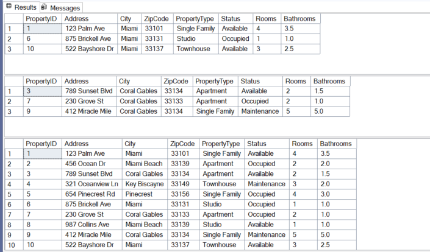

# Property Management SQL Database

## Project Overview
This project is a relational database designed to manage property management information, including properties, tenants, lease agreements, and maintenance requests.

The database was created using SQL Server and demonstrates database design, table relationships, data integrity, data manipulation, and querying across multiple related tables.

## Database Structure

The database contains four related tables:

- **Properties** – Stores property details such as address, city, property type, status, number of rooms, and bathrooms.
- **Tenants** – Stores tenant contact information.
- **LeaseAgreements** – Connects tenants to properties and stores lease start and end dates.
- **MaintenanceRequests** – Tracks maintenance requests associated with properties and tenants.

## Database Relationships

The database uses primary and foreign keys to connect the tables:

- `LeaseAgreements.PropertyID` → `Properties.PropertyID`
- `LeaseAgreements.TenantID` → `Tenants.TenantID`
- `MaintenanceRequests.PropertyID` → `Properties.PropertyID`
- `MaintenanceRequests.TenantID` → `Tenants.TenantID`

Referential integrity is maintained using:

- `ON DELETE CASCADE` for related lease agreements and property maintenance requests.
- `ON DELETE SET NULL` to preserve maintenance records when a tenant is deleted.

## Data Integrity

A `CHECK` constraint ensures that a lease end date must occur after its start date.

```sql
CHECK (EndDate > StartDate)
```

## Database ERD

The Entity Relationship Diagram below shows the structure of the database and the relationships between Properties, Tenants, Lease Agreements, and Maintenance Requests.


## Stored Procedure Results

The stored procedure can dynamically retrieve properties based on optional filtering criteria, including city, Property ID, or no filter.


